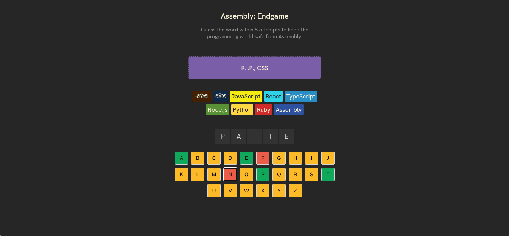

# Assembly Endgame

A fun, hangman-style word guessing game built with React. Can you guess the word before the world of programming succumbs to Assembly?



## 📜 Description

In "Assembly: Endgame", your mission is to guess a secret word one letter at a time. You have 8 attempts to guess the word correctly. For every wrong guess, a modern programming language is "sacrificed" to Assembly. If you can't guess the word in time, you lose, and it's time to start learning Assembly!

## ✨ Features

- **Random Words**: A new word is chosen for every game.
- **Interactive Keyboard**: Click the letters to make your guess. Used letters are disabled and color-coded based on whether they are correct or not.
- **Game Status**: Get immediate feedback on whether your guess is right or wrong, and see win/loss messages.
- **Farewell Messages**: For every wrong guess, a language is lost with a unique "farewell" message.
- **Confetti!**: Celebrate your victory with a shower of confetti when you win.
- **Play Again**: A "New Game" button appears when the game is over to easily start a new round.

## 🚀 Getting Started

To run this project locally, follow these steps:

1.  **Clone the repository:**
    ```bash
    git clone https://github.com/0xYurii/Assembly-EndGame.git
    ```
2.  **Navigate to the project directory:**
    ```bash
    cd Assembly-EndGame
    ```
3.  **Install dependencies:**
    ```bash
    npm install
    ```
4.  **Start the development server:**
    ```bash
    npm run dev
    ```
